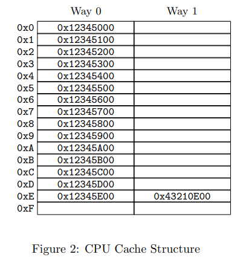

# Cache Coherency

Gongze Cao, 2022/09/29

---

<!-- .slide: data-auto-animate -->

## Outline
* Cache structure
* How cache got swapped in and out
    * cache pingpong
    * what is cache friendly?

---

<!-- .slide: data-auto-animate -->

## Outline
* Cache structure
* How cache got swapped in and out
    * cache pingpong
    * what is cache friendly?
* Cache Coherency
    * Why Coherency(example)
    * Cache protocol
    * examples
* prefetcher(?)
---

## Latency numbers that every programmer should know

* How many instructions a cpu core can execute in one nano?
* How many nano a cpu need to fetch a data item from L1 cache, what about L2/3 cache? Memory?
<!-- pretty much like you are doing homework, but you have to fetch and hand in the homework from and to the office. Of course you will put some homework to the desk next by -->
--

## cacheline
* what is a data item?
* why dont we have cache item?
* why dont we have scattered cache item?
* data locality and cost determines that we have to fetch in cacheline?

--

## cache structure
* Basically a fixed sized HashMap(from what to what?)
<!-- address to cache line, but not precisely, as we will see -->

--

## cache structure

* 16 sets, *set* is the number of buckets.
* 2 ways, *way* is the size of buckets.
<!-- for a hash map we need to determine, what is the hash function, what is the equal function -->
* hash function being the last but **eight** bits of address, the equal function is the rest of the address(except the last four bits).

--

## cache structure
<!-- .slide: data-auto-animate -->

`0x12345E00`

--

## cache structure
<!-- .slide: data-auto-animate -->

`0x12345E00`
::: .container
::: left
`0x12345`

tag
:::

::: middle
`E`

*hash* index
:::

::: right
`00`

offset
:::

::: 

--

## cache structure

* Why do we choose the hash function like this? (*Hint: locality again*)

--

## cache structure

* what are we talking about when we talk about cache line length?
or what do we have in our cache line?

--

## cache behavior
1. what will happen if we want to read a data item?
2. what will happen if we want to write a data item?

note: the plain scenario could be very simple. But in case of multicore processing.

---

## MESI protocol

* cache line state as a node {.fragment}
* message as an edge {.fragment}
* action as an update {.fragment}
* Cache behavior as a temporal graph {.fragment}

--

## temporal graph

--

## MESI protocol

#### Cache line state:
* modified {.fragment}
* exclusive {.fragment}
* shared {.fragment}
* invalid {.fragment}

note: difference between modified and exclusive is whether you need to writeback, also whether can be shared without sending message

--

## MESI protocol

