# Cache Coherency

Gongze Cao, 2022/09/29

---

<!-- .slide: data-auto-animate -->

## Outline
* Cache structure
* Cache coherence
    * MESI protocol
        * MESI state and message
        * Cache contention
        * Memory Barrier

---

<!-- .slide: data-auto-animate -->

## Outline
* Cache structure
* Cache coherence
    * MESI protocol
        * MESI state and message
        * Cache contention
    * Memory Barrier
        * Store buffer
            * Store forwarding
        * Invalidation queue
        * Examples
        * Memory Barrier for specific processors

---

## Latency numbers that every programmer should know

* How many instructions a cpu core can execute in one nano?
* How many nano a cpu need to fetch a data item from L1 cache, what about L2/3 cache? Memory?

[click me](./external/latency-numbers/latency-numbers.html)

note:pretty much like you are doing homework, but you have to fetch and hand in the homework from and to the office. Of course you will put some homework to the desk next by
--

## Cache
* transparent  {.fragment}
* we want it to quickly store when it is not full  {.fragment}
* we want it to quickly load when it has the answer  {.fragment}
* just like a hash map  {.fragment}

<!-- * what is a data item?
* why dont we have cache item?
* why dont we have scattered cache item?
* data locality and cost determines that we have to fetch in cacheline?

note: ram bus is 64 bytes, so a request has to be 64 bytes to be economic -->

--

## Cache structure

```
template<
    class Key,
    class T,
    class Hash = std::hash<Key>,
    class KeyEqual = std::equal_to<Key>,
    class Allocator = std::allocator< std::pair<const Key, T> >
> class unordered_map;
```

* What is `Key`?
* the address obviously(why?)  {.fragment}
* virtual address or real address? {.fragment}

note:think about machine code; virtually indexed and physically tagged first level
<!-- note:address to cache line, but not precisely, as we will see -->

--

## Cache structure
```
template<
    class Key,
    class T,
    class Hash = std::hash<Key>,
    class KeyEqual = std::equal_to<Key>,
    class Allocator = std::allocator< std::pair<const Key, T> >
> class unordered_map;
```
* What is `T`?
* `T` is so called cache line. {.fragment}
* Why do we have cache line? Instead of cache item? {.fragment}

note: ram bus and locality

--

## Cache structure

```
template<
    class Key,
    class T,
    class Hash = std::hash<Key>,
    class KeyEqual = std::equal_to<Key>,
    class Allocator = std::allocator< std::pair<const Key, T> >
> class unordered_map;
```
* What is `Hash` and `KeyEqual`?

--

## Cache structure


* 16 sets, *set* is the number of buckets. {.fragment}
* 2 ways, *way* is the size of buckets. {.fragment}
* hash function being the last but **eight** bits of address, the equal function is the rest of the address(except the last eight bits). {.fragment}

note: what is the size of the cache in picture


--

## cache structure
<!-- .slide: data-auto-animate -->


`0x12345E00`

--

## cache structure
<!-- .slide: data-auto-animate -->


`0x12345E00` {.col style="height:50%; width:100%;float: middle;"}
::: .container {.col style="height:50%; width:100%;float: middle;"}
::: left
`0x12345`

tag
:::

::: middle
`E`

*hash* index
:::

::: right
`00`

offset
:::

::: 


--

## cache structure

* Why do we choose the hash function like this? (*Hint: locality again*)

--

## cache behavior

1. what will happen if we want to read a data item?
* when it exists in cache
* when it does not exist in cache
2. what will happen if we want to write a data item?
* when it exists in cache
* when it does not exist in cache

[cache structure](./external/cache-demo/VivioJS-cache-help.html)

note: the plain scenario could be very simple. But in case of multicore processing.

--

## cache behavior

### SMP scenario requirement

1. Consistency: only one core has newest value {.fragment}
2. Visibility: No core has outdated value {.fragment}
3. Behaves as a whole {.fragment}

---

## Cache protocol

* cache line state as a node {.fragment}
* message as an edge {.fragment}
* action as an update {.fragment}
* Cache behavior as a temporal graph {.fragment}

--

## Temporal graph


--

<!-- .slide: data-auto-animate -->

## MSI protocol

#### Cache line state:
* modified {.fragment}
* shared {.fragment}
* invalid {.fragment}

note: actually a reader-writer lock state

--

<!-- .slide: data-auto-animate -->

## MESI protocol

#### Cache line state:
* modified {.fragment}
* exclusive {.fragment}
* shared {.fragment}
* invalid {.fragment}

note: difference between modified and exclusive is whether you need to writeback, also whether can be shared without sending message


--

## MESI protocol

#### Cache line message:

* read & read-response {.fragment}
* invalidate & invalidate-acknowledge {.fragment}
* Read Invalidate {.fragment}
* Writeback {.fragment}

note: 1. read&response are a pair, 
2. read invalidate is actually a combination(it wants to grab some cache and declare it to be exclusive). 
3. Writeback is a way to invalidate some cache and make rooms.
quiz: 1. what happen when 2 cpus tries to invalidate the same cache atm? talk to jury
2. invalidate storm yes and directory cache
2. why bother SMP

--

## MESI protocol

#### MESI state diagram

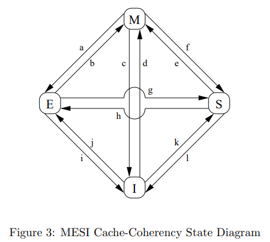

[demo](external\MESI-demo\VivioJS-MESI-help.html)

--

## MESI protocol
### Other possible states: 

- Owner {.fragment}


--

## MESI protocol

#### cache contention, aka false sharing, also aka cache pingpong

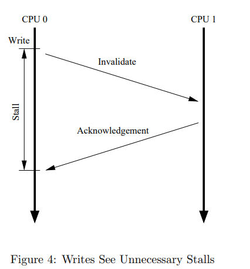

--

## MESI protocol

#### cache contention, aka false sharing, also aka cache pingpong

* imagine a thread create an object that takes in a cacheline
* then pass it to other threads to amend
* invalidation costs because of messaging {.fragment}
* we need to avoid it {.fragment}

**Q:** Do we have suspicious cache contention in our system? What about market data? {.fragment}

[example(by chatgpt!)](./external/cache-contention/False-Sharing-C++-Example.html)  {.fragment}

--

## MESI protocol

#### cache contention, aka false sharing, also aka cache pingpong

**Remedy(?)**:
```c++
struct keep_apart {
  alignas(std::hardware_destructive_interference_size) std::atomic<int> cat;
  alignas(std::hardware_destructive_interference_size) std::atomic<int> dog;
};
```
Make sure the shared cache-line is either read-only, or owned by a certain thread.
note: we used both

---

## Memory Barrier

### Store buffer


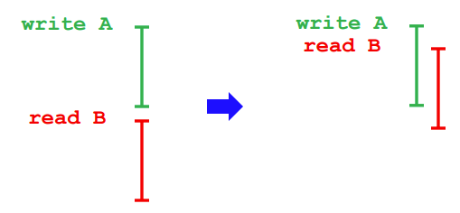 {.col style="height:50%; width:100%;float: middle;"}

Why do we bother wait for acknowledge?

note: invalidation costs too much as we've seen. but we already know the result! we know every single state we need to continue processing next instructions. So all we need to do is continue, and when the acknowledge comes back, overwrite it.

--

### Store buffer

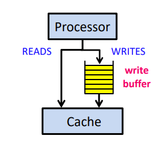

note: we need a place to store all the invalidation requests. a FIFO queue as abstraction sounds valid. You can imagine the queue being a spmc queue, the real write happens when the request is popped out the queue.

--

### Store buffer

#### example 1

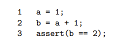{:height="700px" width="50%"}
::: .container

::: left

Core 0

a=0
:::

::: right

Core 1

b=0

:::

:::


note: imagine a and b are on core 0 and core 1, and the following code in ran on core 1. At first core 0 and core 1 has a and b respectively in their cache both exclusive. What will happen when core 1 wants to execute the code?

--

### Store buffer
#### Store forwarding

Store buffer is more than a FIFO queue, it is also a map allows being snooped.

Question: why don't we just write the write request to cache? {.fragment}

note: ofc this is because 1. we might not have that cacheline in our cache. 2. there might be other data in the cacheline

--

### Store buffer

#### example 1

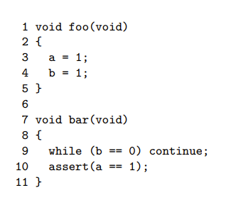{:height="700px" width="50%"}

::: .container

::: left

Core 0

b=0 | E

`foo()`

:::

::: right

Core 1

a=0 | E

`bar()`

:::

:::

note: why core 0 will issue a "read invalidate" rather than simply just an invalidate

--

### Read memory barrier

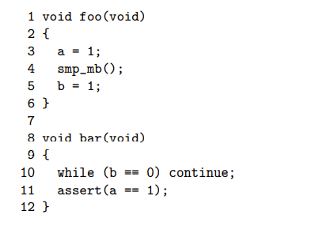

While we do not have instruction to flush cache, we can flush store buffer.

note: why we call it a memory barrier? it is actually a memory *request* barrier, or to say filter. This barrier will not let those requests in the store buffer pass it. Q: what else effect will the memory barrier has?(cpu prefetch and prediction)

---

### Invalidate queue

* In practice the store buffer is filled up easily, so we need constantly wait.
* What can we do to shorten the wait time?

note: we all know there are two ways to overcome the peak problem in producer consumer problem, that is increase the queue size, or reduce the latency. There we choose to reduce the latency; because the latency is comprised by two parts, one is the communication cost, one is invalidate cost, and the former is sorta fixed. We choose to make the invalidate operation, again non-blocking.

--

### Invalidate queue

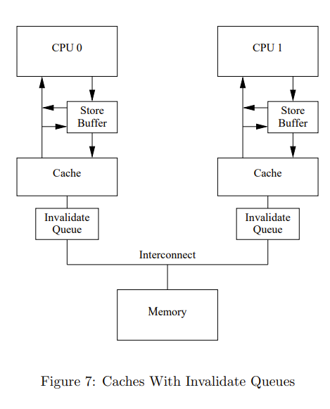

--

### Invalidate queue

#### example 2

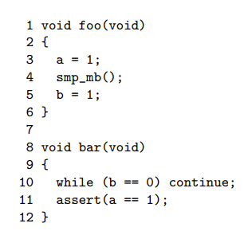

::: .container

::: left

Core 0

a=0 | S

b=0 | E

`foo()`

:::

::: right

Core 1

a=0 | S

`bar()`

:::

:::

note: we might step into bar after foo is done. when a is stuck in invalidation queue, there might be misorder Q: why core 0 will issue a "invalidate" rather than again an "read invalidate"

--

### Invalidation queue

#### Remedy

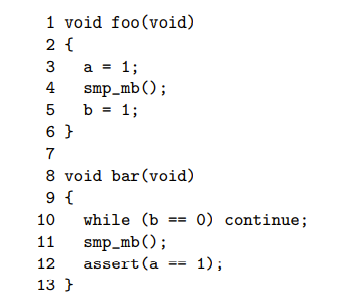

note:now this assert will not always be triggered in all possible paths

--

### Invalidation queue

### Memory Barrier

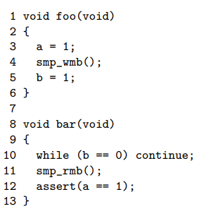

**Takeaways:** {.fragment}
* `smp_rmb`: flush invalidation queue {.fragment}
* `smp_wmb`: flush store buffer {.fragment}
* `smp_mb`: flush both {.fragment}

They are mapped to different implementation in different platforms. {.fragment}

note: we either flush store buffer or flush memory barrier. They are different barriers. In gcc they are implemented using gcc intrinsic.

---

## X86
Load Load
---

## X86 and Linux
`/arch/x86/include/asm/barrier.h`
```
#ifdef CONFIG_X86_32
#define mb() asm volatile(ALTERNATIVE("lock; addl $0,-4(%%esp)", "mfence", \
				      X86_FEATURE_XMM2) ::: "memory", "cc")
#define rmb() asm volatile(ALTERNATIVE("lock; addl $0,-4(%%esp)", "lfence", \
				       X86_FEATURE_XMM2) ::: "memory", "cc")
#define wmb() asm volatile(ALTERNATIVE("lock; addl $0,-4(%%esp)", "sfence", \
				       X86_FEATURE_XMM2) ::: "memory", "cc")
#else
#define __mb()	asm volatile("mfence":::"memory")
#define __rmb()	asm volatile("lfence":::"memory")
#define __wmb()	asm volatile("sfence" ::: "memory")
#endif
```

---

## X86 and C++

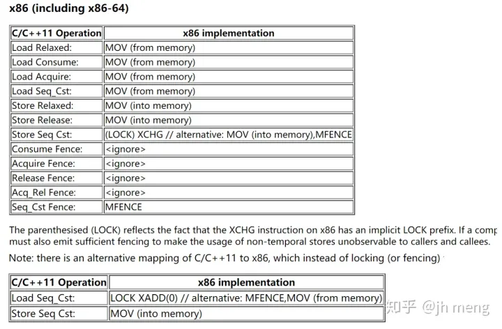


---

## More topics to explore
* MMU and TLB
* Directory based and snoop based cache synchronization
* Cache replacement strategy

---

## Takeaways:
* Memory order are a representation and result of cache coherence
* The guarantee of memory order is from top to down: Code=>Compiler=>Circuits

---

Reference: 
[1]: https://coolshell.cn/articles/20793.html
[2]: https://www.bilibili.com/video/BV1e64y1T7J3/
[3]: https://www.bilibili.com/video/BV1fK4y1E7NC/
[4]: https://inst.eecs.berkeley.edu/~cs61c/su18/

